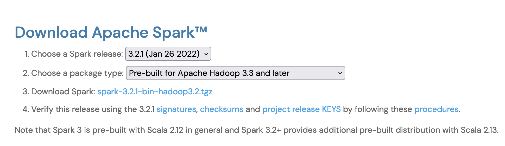

# Spark Labs (pyspark)

Hands-on module for DSC Data Engineer path

## Running Spark
Spark can be used from Python, Java, or Scala, R, or SQL. Spark itself is written in Scala, and runs on the Java Virtual
Machine (JVM) and therefore to run Spark either on your laptop or a cluster, all you need is an installation of Java 6 or newer. If you wish to use the Python API you will also need a Python interpreter (version 2.6 or newer). If you wish to use R you’ll also need a version of R on your machine.

## Download Spark
Let’s start by downloading a recent precompiled released
version of Spark. Visit http://spark.apache.org/downloads.html, select the package type of “Pre-built for Hadoop
2.7 and later” and click “Direct Download.” This will download a compressed TAR file, or tarball. The majority of this
book was written during the release of Spark 2.1 and 2.2 so downloading any version 2.2 or greater should be a good
starting poin

### Downloading Spark for your Hadoop Version
You don’t need to have Hadoop, but if you have an existing Hadoop cluster or HDFS installation, download the
matching version. You can do so from http://spark.apache.org/downloads.html by selecting a different package type,
but they will have slightly different filenames. We discuss how Spark runs on clusters in later chapters, but at this
point we recommend running a pre-compiled binary on your local machine to start out.

### Building Spark from Source
Once you’ve downloaded Spark, you’ll want to open up a command line prompt and unzip the package. In our case,
we’re unzipping Spark 2.1. The following is a code snippet that you can run on any unix style command line in order to
unzip the file you downloaded from Spark and move into the directory.

